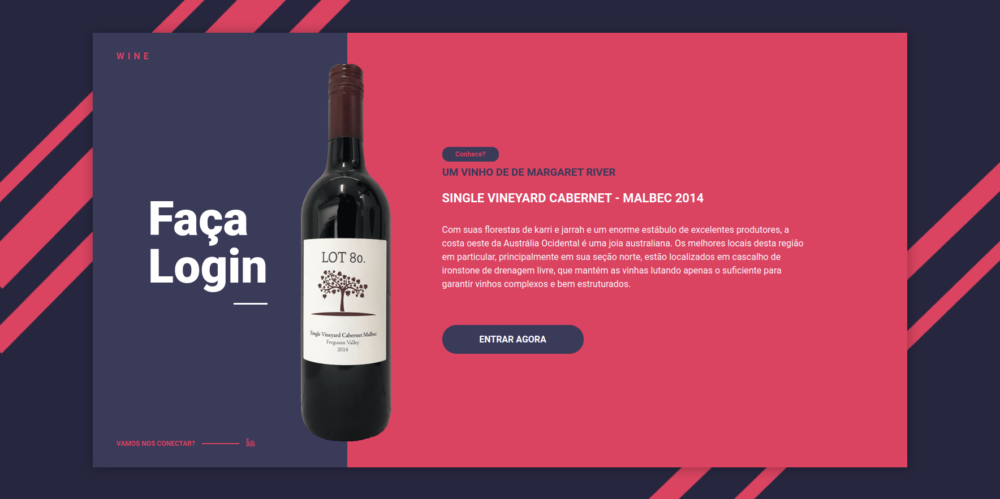

<p align="center">
  

  

  <a href="https://github.com/MarcosWillianR/desafio-venda-de-vinhos/commits/master">
    
  </a>

  

  <a href="https://github.com/MarcosWillianR/desafio-venda-de-vinhos/stargazers">
    
  </a>

  <a href="https://github.com/MarcosWillianR">
    
  </a>
</p>

<h1 align="center">Wine</h1>

<p align="center">
 <a href="#-tecnologias">Tecnologias</a> •
 <a href="#-autor">Autor</a>
</p>

<h4 align="center">🚧 Teste Concluído 🚧</h4>

### Web

<p align="center" style="display: flex; align-items: flex-start; justify-content: center;">
  
</p>

<p align="center" style="display: flex; align-items: flex-start; justify-content: center;">
  
</p>


### Pré-requisitos

Antes de começar, você vai precisar ter instalado em sua máquina as seguintes ferramentas:
[Git](https://git-scm.com), [Node.js](https://nodejs.org/en/).
Além disto é bom ter um editor para trabalhar com o código como [VSCode](https://code.visualstudio.com/)

#### 🧭 Rodando a aplicação

```bash

# Clone este repositório
$ git clone https://github.com/MarcosWillianR/desafio-venda-de-vinhos

# Acesse a pasta do projeto no seu terminal/cmd
$ cd desafio-venda-de-vinhos

# Instale as dependências do frontend
$ cd web && npm install ou yarn

# Instale as dependências do backend
$ cd server && npm install ou yarn

# Execute o servidor (não precisa de um banco de dados) em modo de desenvolvimento
$ cd server && npm run dev:server ou yarn run dev:server

# Execute a aplicação em modo de desenvolvimento
$ cd web && npm start ou yarn start

# A aplicação será aberta na porta:3000 - acesse http://localhost:3000

# Para rodar os testes do servidor
$ cd server && npm run test ou yarn run test
```

## 🛠 Tecnologias

As seguintes ferramentas foram usadas na construção do projeto:

#### **Website**  ([React](https://reactjs.org/)  +  [TypeScript](https://www.typescriptlang.org/))

-   **[React Icons](https://react-icons.github.io/react-icons/)**
-   **[Axios](https://github.com/axios/axios)**
-   **[Styled Components](https://github.com/styled-components/styled-components)**
-   **[React Router Dom](https://github.com/ReactTraining/react-router/tree/master/packages/react-router-dom)**

> Veja o arquivo  [package.json](https://github.com/MarcosWillianR/desafio-venda-de-vinhos/blob/master/web/package.json)

#### **Servidor**  ([Node.JS](https://nodejs.org/en/)  +  [TypeScript](https://www.typescriptlang.org/))

-   **[Jest](https://github.com/facebook/jest)**
-   **[Express](https://github.com/expressjs/express)**
-   **[Axios Mock Adapter](https://github.com/ctimmerm/axios-mock-adapter)**
-   **[Axios](https://github.com/axios/axios)**
-   **[Date-fns](https://github.com/date-fns/date-fns)**

> Veja o arquivo  [package.json](https://github.com/MarcosWillianR/desafio-venda-de-vinhos/blob/master/server/package.json)

## 🦸 Autor

 
 <br />
 <sub><b>Marcos Willian</b></sub></a>
 <br />

[](https://www.linkedin.com/in/marcos-willian-977311188/)
[](markusuuuu@gmail.com)

---

## 📝 Licença

Este projeto esta sobe a licença [MIT](./LICENSE).

Feito com ❤️ por Marcos Willian 👋🏽 [Entre em contato!](https://www.linkedin.com/in/marcos-willian-977311188/)